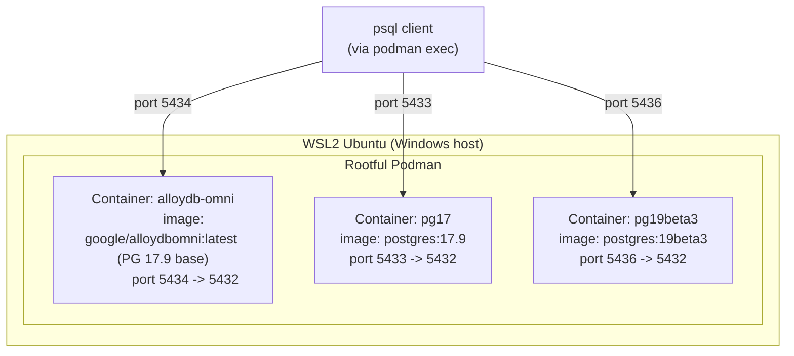
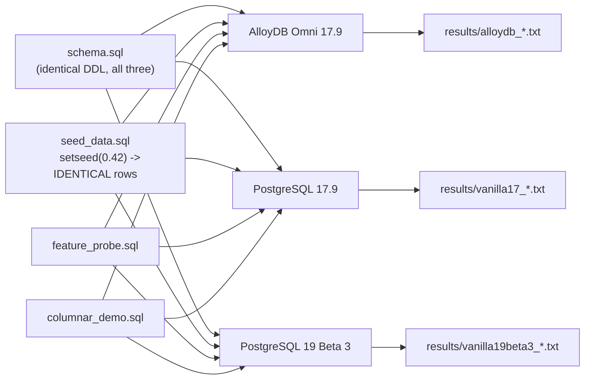
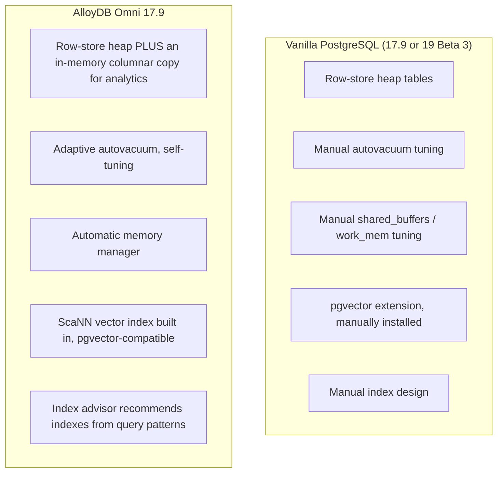

# AlloyDB Omni vs Vanilla PostgreSQL — WSL2 Podman PoC (3-way comparison)


> A personal, run-it-yourself, **3-way** comparison I put together out of
> curiosity about how AlloyDB Omni actually compares to plain PostgreSQL —
> not a vendor benchmark, not sponsored, just my own hands-on findings:
> - **AlloyDB Omni 17.9** — Google's PostgreSQL-compatible engine
> - **PostgreSQL 17.9** — the *fair* baseline: same core version AlloyDB Omni is built on
> - **PostgreSQL 19 Beta 3** — a bonus "what's coming in core Postgres" track
>
> All three run as rootful Podman containers on WSL2, loaded from the exact
> same schema and the exact same (seeded, reproducible) data. Everything
> here is scripted end to end — clone this repo, run the scripts in order,
> and you'll reproduce the same numbers I got (or find your own, on your
> own hardware).

## Table of contents

- [The analogy](#the-analogy)
- [Why three engines, not two](#why-three-engines-not-two)
- [Architecture](#architecture)
- [What's actually different under the hood](#whats-actually-different-under-the-hood)
- [Prerequisites](#prerequisites)
- [Why this exists](#why-this-exists)
- [Repo layout](#repo-layout)
- [Run the PoC](#run-the-poc)
- [Feature comparison table](#feature-comparison-table)
- [What's worth digging into first](#whats-worth-digging-into-first)
- [Passwords: sudo vs Passw0rd! vs no password at all](#passwords-sudo-vs-passw0rd-vs-no-password-at-all)
- [Cheat sheet](#cheat-sheet)
- [Troubleshooting](#troubleshooting)
- [Findings log](#findings-log)
- [Cleanup](#cleanup)
- [References](#references)

## The analogy

> Think of vanilla PostgreSQL as a well-built **general-purpose delivery
> van**. It does everything: pick up, drop off, city or highway, one driver,
> one engine, and you tune the suspension and route yourself.
>
> AlloyDB Omni is the **same van chassis**, but Google has bolted on a
> turbocharger (columnar engine for analytics), a self-adjusting suspension
> (adaptive autovacuum + automatic memory management), a co-pilot who
> suggests better routes (index advisor), and a faster GPS for finding
> similar addresses (ScaNN vector search). It's still a PostgreSQL van —
> same controls, same driving license — it just does more of the tuning
> for you, at a licensing cost once you use it in production.
>
> Comparing that turbocharged van against a **newer-model** plain van
> (PostgreSQL 19 Beta 3 vs AlloyDB's PostgreSQL 17.9 base) isn't quite
> fair either — the newer plain van has its own factory improvements that
> have nothing to do with turbochargers. That's why this PoC drives all
> three: turbocharged 17.9, plain 17.9, and plain 19 Beta 3.

## Why three engines, not two

AlloyDB Omni's `:latest` image currently tracks **PostgreSQL 17.9**.
PostgreSQL 19 Beta 3 is two major versions ahead. A straight AlloyDB-vs-19beta3
comparison mixes two different things together — the AlloyDB engine's own
improvements, AND two versions' worth of core PostgreSQL planner/executor
improvements — and you can't tell from the numbers alone which one you're
looking at.

This PoC resolves that by running:

| Container | Purpose |
|---|---|
| `alloydb-omni` | The engine under test |
| `pg17` | **Fair baseline** — same PostgreSQL major.minor (17.9) as AlloyDB. Any timing difference here is genuinely the AlloyDB engine. |
| `pg19beta3` | **Bonus track** — shows where core PostgreSQL is headed. Treat it as a separate data point, not blended into the AlloyDB comparison. |

## Architecture





## What's actually different under the hood



Both engines speak the same wire protocol, take the same SQL, and are
driven by the same `psql`. The differences live in the engine's background
processes and a handful of `google_*` / `alloydb*` extensions — not in the
tables you create or the client tools you use.

## Prerequisites

- WSL2 with Ubuntu (or similar), Podman installed, rootful mode available
  via `sudo`
- Internet access from WSL2 to Docker Hub (`docker.io`)
- ~8 GB free disk for all three images, a few hundred MB for sample data
- `psql` client tools inside the containers (already bundled — no separate
  client install needed)
- **Shared memory for the columnar engine:** the AlloyDB container is
  started with `--shm-size=1g` because Podman's 64MB default is too small
  for `google_columnar_engine_add()` — it fails with `could not resize
  shared memory segment ... No space left on device` otherwise.

## Why this exists

I wanted to know, hands-on, whether AlloyDB Omni's claims hold up against
plain PostgreSQL — not from a vendor deck, from my own containers and my
own `EXPLAIN ANALYZE` output. Every script here is exactly what I ran;
every number in the findings log is exactly what came back. Clone it, run
it, and see for yourself — corrections and issues welcome.

## Repo layout

```
alloydb-vs-postgres19-poc/
├── README.md
├── scripts/
│   ├── 00-env.sh                       # shared settings for all three engines
│   ├── 01-setup-alloydb.sh             # pulls + starts AlloyDB Omni (port 5434)
│   ├── 02-setup-vanilla-pg17.sh        # pulls + starts PostgreSQL 17.9 — FAIR baseline (port 5433)
│   ├── 03-setup-vanilla-pg19beta3.sh   # pulls + starts PostgreSQL 19 Beta 3 — bonus track (port 5436)
│   ├── 04-load-sample-data.sh          # identical, reproducible data into all three + parity check
│   ├── 05-run-feature-probes.sh        # fingerprints all three, diffs AlloyDB vs each vanilla
│   ├── 06-enable-columnar-engine.sh    # turns on AlloyDB's columnar engine (AlloyDB only)
│   ├── 07-columnar-engine-benchmark.sh # timed 3-way comparison + columnar-usage check
│   └── 99-cleanup.sh                   # single-command teardown, all three
├── sql/
│   ├── schema.sql                      # retail orders schema (all three engines)
│   ├── seed_data.sql                   # setseed()'d, reproducible data generator
│   ├── feature_probe.sql               # extension/GUC introspection queries
│   └── columnar_demo.sql               # Section A/B/C — see inline comments
└── results/                            # created at runtime, safe to delete
```

## Run the PoC

> All commands assume you're inside `scripts/`. Every script sources
> `00-env.sh`, so override ports/passwords with environment variables if
> you need to, instead of editing the scripts.

```bash
cd alloydb-vs-postgres19-poc/scripts
chmod +x *.sh

./01-setup-alloydb.sh              # AlloyDB Omni 17.9, port 5434
./02-setup-vanilla-pg17.sh         # PostgreSQL 17.9 (fair baseline), port 5433
./03-setup-vanilla-pg19beta3.sh    # PostgreSQL 19 Beta 3 (bonus track), port 5436

./04-load-sample-data.sh           # identical data into all three + parity check
./05-run-feature-probes.sh         # fingerprints all three, pairwise diffs

./06-enable-columnar-engine.sh     # flips on AlloyDB's columnar engine (AlloyDB only)
./07-columnar-engine-benchmark.sh  # the 3-way timed comparison — run this LAST
```

> **Don't skip `06`.** The columnar engine ships **off by default** on
> AlloyDB Omni. Without it, `07` just compares three row-store engines.
>
> **Never reload AlloyDB's data after `06`.** `04-load-sample-data.sh` runs
> `DROP TABLE` / `CREATE TABLE`, which changes table OIDs and silently
> resets the columnar registration `06` just set up. If you ever need to
> reload AlloyDB's data specifically, re-run `06` again immediately after.

## Feature comparison table

**How to read the "Verified" column:** this PoC ran `feature_probe.sql`
(extension/GUC introspection) and `columnar_demo.sql` (`EXPLAIN ANALYZE`
benchmarks) against all three live containers — see `results/*.txt` for
the raw output. Anything marked ✅ **Benchmarked** or 🔎 **Confirmed
present** came from those runs. Anything marked 📄 **Docs only** is
Google's published claim, not independently verified here — check
Google's docs directly before repeating those numbers as
fact.

| Area | Vanilla PostgreSQL | AlloyDB Omni | Verified |
|---|---|---|---|
| Core SQL compatibility | Baseline PostgreSQL | Full PostgreSQL compatibility, same drivers/tools | ✅ Benchmarked — identical schema/queries ran unmodified on all three |
| OLTP throughput | Depends entirely on your tuning | Google states up to ~2x transactional throughput on similar hardware | 📄 Docs only — this PoC only ran analytical queries, no OLTP load test |
| Analytics (HTAP) | Row-store only; no built-in columnar store | Built-in columnar engine; Google states up to ~100x on eligible analytical queries | ✅ Benchmarked — extension confirmed enabled, `Custom Scan (columnar scan)` confirmed in the plan, 12–28% faster than PostgreSQL 17.9 on this PoC's dataset (see [Findings log](#findings-log)) |
| Vector search | `pgvector` + HNSW, self-installed | `pgvector`-compatible plus Google's ScaNN index | 🔎 Confirmed present — `vector` and `alloydb_scann` extensions confirmed available via probe; no vector query was actually run in this PoC |
| Vacuum | Manual `autovacuum` tuning | Adaptive autovacuum (self-tuning) | 🔎 Confirmed present — `enable_google_adaptive_autovacuum` confirmed `on` by default via probe; self-tuning behavior itself wasn't load-tested |
| Memory management | Manual `shared_buffers` / `work_mem` | Automatic memory manager | 🔎 Confirmed present — automatic memory GUCs (e.g. `shared_memory_expand_ratio`) confirmed via probe; not load-tested |
| Index design | Fully manual | Index advisor recommends indexes from observed query patterns | 🔎 Confirmed present — `google_db_advisor` extension confirmed available via probe; no recommendation was actually generated in this PoC |
| High availability | Manual streaming replication + Patroni-style tooling | Built-in HA, strongest under the AlloyDB Omni Kubernetes operator | 📄 Docs only — this PoC runs single-node containers, no HA topology was tested |
| Delivery | OS packages / source build | Single container image, dependencies bundled | ✅ Benchmarked — this is literally how all three containers were pulled and run |
| Licensing | Free, open source, any purpose | Free for dev/test; per-vCPU subscription required in production | 📄 Docs only — not something a PoC can verify |

> ⚠️ Nothing in this table is a Google claim reworded as if I verified it — check the
> "Verified" column and `results/*.txt` for what this specific PoC run
> actually showed.

## What's worth digging into first

If you're reproducing this and want to know where to look before you dive
into all the raw output in `results/`:

1. **Row-count parity check** from `04-load-sample-data.sh` — confirms the
   dataset really is identical across all three engines before you trust
   anything downstream.
2. **Side-by-side `\dx` and `pg_available_extensions`** (from
   `results/probe_diff_vs_pg17.txt`) — the fastest way to see it's not just
   PostgreSQL with a new label; a dozen `google_*`/`alloydb*` extensions
   show up that plain PostgreSQL doesn't have.
3. **The `EXPLAIN ANALYZE` execution-time numbers**, AlloyDB vs PostgreSQL
   17.9 specifically — that's the fair, same-version comparison and the
   headline result. Keep the PostgreSQL 19 Beta 3 numbers as a separate
   data point, not blended into the AlloyDB-vs-vanilla story — see [Why
   three engines, not two](#why-three-engines-not-two).
4. **"Index scan vs columnar scan"** — genuinely the most interesting thing
   I found: AlloyDB's optimizer will happily use a regular b-tree index, or
   even a plain seq scan, instead of the column store when either looks
   cheaper. Section C of `columnar_demo.sql` disables both to force the
   `Custom Scan (columnar scan)` node to appear — "columnar" turns out to
   be one more tool the planner picks between, not a blanket speedup.
5. **The autopilot GUCs** (`pg_settings` rows for `%autovacuum%` and
   `%memory%`) — confirms adaptive autovacuum and automatic memory
   management are real, configured settings, not just marketing copy.
6. **Licensing reality check** — free for dev/test, subscription required
   in production. Worth knowing before treating this as a drop-in free
   replacement for anything you'd actually deploy.

## Passwords: sudo vs `Passw0rd!` vs no password at all

Three different credentials show up while running this PoC, and it's easy
to mix them up:

| Prompt | What it wants | When it happens |
|---|---|---|
| `[sudo] password for <you>:` | **Your own Linux login password** | Every `sudo podman ...` command, unless `sudo` cached it from a recent command (it expires after a few minutes of inactivity and asks again) |
| `Password for user postgres:` | **`Passw0rd!`** (set via `POSTGRES_PASSWORD` in `00-env.sh`) | Only when connecting over **TCP** — a host `psql -h localhost ...`, or an external GUI tool (DBeaver, pgAdmin, etc.) pointed at `localhost:5434`/`5433`/`5436` |
| *(no prompt at all)* | Nothing — you're not asked | Any `psql` run **inside** the container, however you got there (`podman exec ... psql` directly, or `podman exec ... bash` then `psql` by hand). Local Unix-socket connections are trusted by default in the official Postgres image, so no password applies |

**Root cause worth knowing:** rootful (`sudo podman`) and rootless (`podman`,
no `sudo`) are two entirely separate container stores on the same machine.
Every script in this PoC uses `sudo podman`, so the containers only exist
in the *root* namespace — dropping `sudo` gets you `no such container`,
not a permission error, even though the container is running fine.

## Cheat sheet

```bash
# Connect straight to psql (via Podman — no local psql client needed, no password)
sudo podman exec -it alloydb-omni psql -U postgres -d pocdb   # AlloyDB Omni 17.9
sudo podman exec -it pg17        psql -U postgres -d pocdb    # PostgreSQL 17.9 (fair baseline)
sudo podman exec -it pg19beta3   psql -U postgres -d pocdb    # PostgreSQL 19 Beta 3 (bonus)

# Get a shell INSIDE the container instead (e.g. to poke around, check disk,
# run psql by hand) — also no password, same local-socket trust as above
sudo podman exec -it alloydb-omni bash
# then, once inside:
psql -U postgres -d pocdb

# Connect from the WSL2/Linux HOST itself, if you have a psql client
# installed there — this is a TCP connection, so it WILL ask for
# Passw0rd!
psql -h localhost -p 5434 -U postgres -d pocdb   # AlloyDB Omni
psql -h localhost -p 5433 -U postgres -d pocdb   # PostgreSQL 17.9
psql -h localhost -p 5436 -U postgres -d pocdb   # PostgreSQL 19 Beta 3

# Connect from an external GUI tool (DBeaver, pgAdmin, TablePlus, etc.):
#   Host: localhost   Port: 5434 / 5433 / 5436   User: postgres
#   Password: Passw0rd!   Database: pocdb

# Container status
sudo podman ps -s

# Tail logs
sudo podman logs -f alloydb-omni
sudo podman logs -f pg17
sudo podman logs -f pg19beta3

# Re-run just the probe or benchmark after tweaking the SQL
./scripts/05-run-feature-probes.sh
./scripts/07-columnar-engine-benchmark.sh

# Full teardown
./scripts/99-cleanup.sh
```

## Troubleshooting

| Symptom | Likely cause | Fix |
|---|---|---|
| `podman: command not found` | Podman not installed in this WSL2 distro | Install via your distro's package manager, then re-run |
| `Error: rootless netns` or permission errors | Script uses `sudo podman` but your shell isn't passwordless-sudo | Run scripts with a shell that can prompt for/cache sudo, or export `CONTAINER_RUNTIME=podman` if you run rootless |
| `createdb: FATAL: the database system is shutting down` right after setup | Official postgres-based images do an internal `initdb → temporary startup → run init scripts → shutdown → real startup` cycle on first boot; a single `pg_isready` success can land in that window | Already handled: `wait_for_pg_ready()` requires 3 consecutive ready checks and `retry_cmd()` retries `createdb`. Just re-run the setup script if it still happens — it's idempotent |
| Row counts don't match across the three engines | `seed_data.sql` was edited without keeping `setseed(0.42)` at the top, or one container's load failed partway | `04-load-sample-data.sh` checks this explicitly and prints a warning — scroll up in its output for the actual error |
| `could not resize shared memory segment ... No space left on device` when running `google_columnar_engine_add()` | Podman's default `--shm-size` (64MB) is too small for the columnar engine | Recreate the AlloyDB container via `01-setup-alloydb.sh` (already sets `--shm-size=1g`), reload data with `04-load-sample-data.sh`, then re-run `06-enable-columnar-engine.sh` |
| `google_columnar_engine_add()` returns `0`, or columnar scan never shows up in `07`'s benchmark | Either the shared-memory issue above (check for a `WARNING:` line), or **AlloyDB's data was reloaded after `06` ran**, which resets the columnar registration | Re-run `06-enable-columnar-engine.sh` any time you reload AlloyDB's data — never run `04` against AlloyDB without following it with `06` again |
| Section C still doesn't show `Custom Scan (columnar scan)` even with index scans off | At this PoC's data volume the planner can legitimately decide a plain `Seq Scan` is cheaper than the columnar scan — cost-based optimization doing its job | Section C also disables `enable_seqscan`, forcing the columnar scan as the only remaining path — a demo technique only, never a production setting |
| `SET LOCAL can only be used in transaction blocks` warning | `psql -f` autocommits each statement by default — `SET LOCAL` needs an explicit transaction | Already fixed: Section C of `columnar_demo.sql` wraps its `SET LOCAL` calls in `BEGIN`/`COMMIT` |

## Findings log

> Confirmed run: 200,000 orders / 600,000 order_items, identical row counts
> on all three engines (setseed-verified). AlloyDB's columnar engine was
> confirmed populated and actually used (`Custom Scan (columnar scan)`
> appeared in Section C's plan) before these numbers were captured.

| Query | AlloyDB Omni 17.9 | PostgreSQL 17.9 (fair) | AlloyDB advantage | PostgreSQL 19 Beta 3 (bonus track) |
|---|---|---|---|---|
| Monthly revenue by region (Section B) | 1419.7 ms | 1613.3 ms | ~12% faster | 1304.0 ms |
| Revenue by category (Section B) | 88.2 ms | 121.8 ms | ~28% faster | 51.9 ms |
| Revenue by category, indexes/seqscan disabled, columnar forced (Section C) | 421.9 ms | 557.2 ms | ~24% faster | 53.0 ms |

**Read this as two separate stories, not one:**
- **AlloyDB vs its true peer (PostgreSQL 17.9):** AlloyDB wins on all three
  queries, 12–28% faster, with the columnar engine confirmed in use. This
  is the defensible "the AlloyDB engine itself is faster" finding.
- **PostgreSQL 19 Beta 3, separately:** it outran *both* 17.9-based engines
  on every query — including AlloyDB's columnar-accelerated Section C
  query. That's core PostgreSQL's own two-major-version improvement, not
  a loss for AlloyDB against a real competitor. This is exactly why the
  3-way split matters: a straight AlloyDB-vs-19beta3 comparison would have
  made AlloyDB look like it was losing, when it's actually winning against
  its real peer and simply being outpaced by unrelated core-Postgres gains.

## Cleanup

```bash
./scripts/99-cleanup.sh
```

Removes all three containers, optionally the pulled images, and optionally
the captured `results/` files — prompts before each destructive step.

## References

- [AlloyDB Omni additions to standard PostgreSQL — Google Cloud docs](https://docs.cloud.google.com/alloydb/omni/docs/additions-to-postgresql)
- [AlloyDB Omni product page](https://cloud.google.com/alloydb/omni)
- [PostgreSQL official Docker image tags](https://hub.docker.com/_/postgres)

---

**Mariyan Clement**
Database Architect
https://www.linkedin.com/in/mariyanclement/
